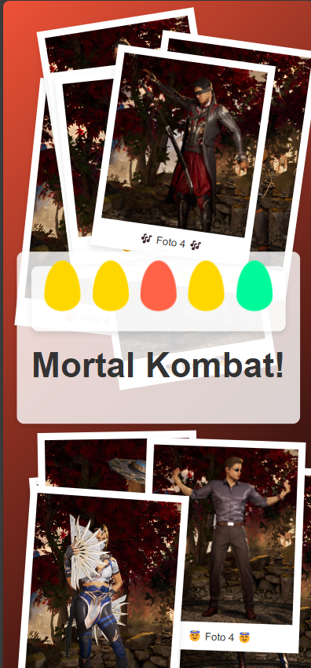

# Photo Collage

[Read in English](./README_EN.md)

Coloca tus fotos y un mensaje en una vista HTML con un estilo Polaroid. Al hacer hover sobre las fotos, estas se verán en primer plano.

## Cómo usar
1. Coloca 16 imágenes (.jpg o .png) dentro de la carpeta **img**.
2. Utiliza renameImages (.bat para Windows o .sh para Linux) para renombrar las imágenes.
3. Modifica la leyenda de las fotos en el archivo **index.html**.
4. Abre **index.html** haciendo doble clic o con un servidor.

## Personalización
- Puedes modificar el color del gradiente de fondo en la propiedad background del estilo de la etiqueta main en **style.css**.
- Puedes modificar o quitar los elementos de colores con las clases CSS **elements** en **style.css**.
- Puedes cambiar el tamaño de las fotos polaroid con la clase CSS **polaroid** en **style.css**.

## Preview
### Escritorio

### Mobile

