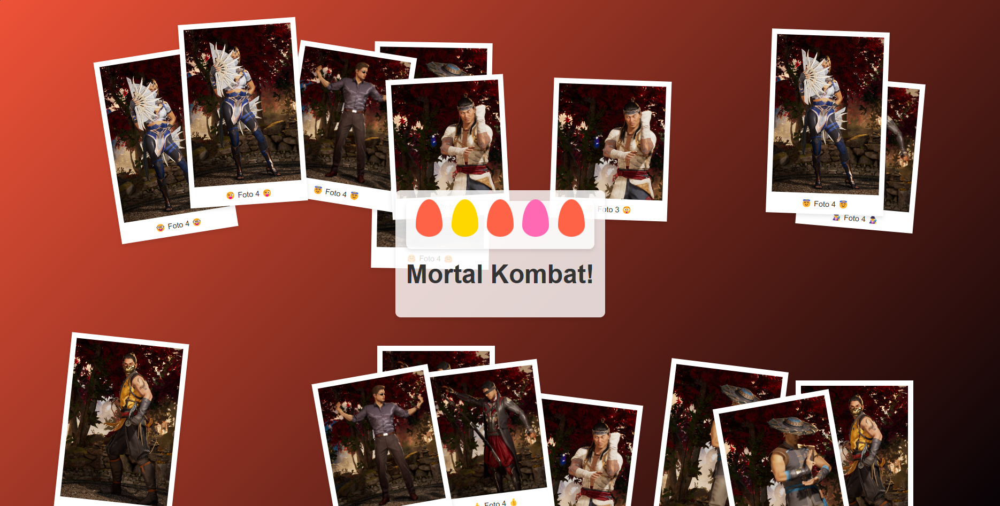
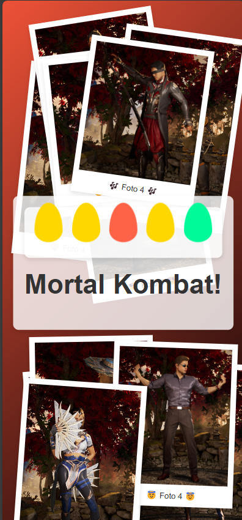

# Photo Collage

[Leer en español](./README.md)

Place your photos and a message in an HTML view with a Polaroid style. When hovering over the photos, they will appear in the foreground.

## How to use
1. Place 16 images (.jpg or .png) inside the **img** folder.
2. Use renameImages (.bat for Windows or .sh for Linux) to rename the images.
3. Edit the photo captions in the **index.html** file.
4. Open **index.html** by double-clicking it or using a server.

## Customization
- You can change the background gradient color in the background property of the main tag style in **style.css**.
- You can modify or remove the colored elements with the **elements** CSS classes in **style.css**.
- You can change the size of the polaroid photos with the **polaroid** CSS class in **style.css**.

## Preview
### Desktop

### Mobile
